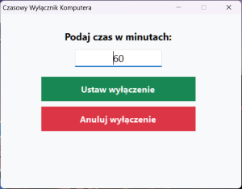

# Czasowy Wyłącznik Komputera (Windows 11)

Prosta, lekka i natywna aplikacja okienkowa dla systemu Windows, pozwalająca na zaplanowanie automatycznego wyłączenia komputera po określonym czasie (w minutach) oraz łatwe anulowanie odliczania.

 <!-- Zastąp ten link własnym zrzutem ekranu -->

## 🌟 Funkcje

* **Prosty interfejs GUI:** Przejrzyste okno aplikacji napisane w C# (.NET Framework).
* **Precyzyjne odliczanie:** Wpisujesz czas w minutach, a program przelicza go i przekazuje komendę bezpośrednio do systemu Windows.
* **Anulowanie w dowolnym momencie:** Przycisk "Anuluj wyłączenie" natychmiast zatrzymuje zegar systemowy.
* **Zero instalacji:** Działa jako pojedynczy plik `.exe` bez potrzeby instalacji.
* **Brak zbędnych procesów w tle:** Program wykonuje polecenie systemowe i nie obciąża pamięci RAM.

---

## 📥 Pobieranie

Przejdź do sekcji **[Releases](../../releases)** i pobierz najnowszą wersję pliku `Wyłącznik czasowy.exe`.

---

## ⚠️ Ostrzeżenie Windows SmartScreen (Pierwsze uruchomienie)

Ponieważ plik `.exe` został skompilowany niezależnie i nie posiada płatnego certyfikatu cyfrowego, Windows SmartScreen może wyświetlić komunikat:  
> *"System Windows ochronił Twój komputer"*

**Jak uruchomić program:**
1. Kliknij napis **Więcej informacji** w oknie ostrzeżenia.
2. Kliknij przycisk **Uruchom mimo to**.
*(Aplikacja jest w 100% bezpieczna, cały jej kod źródłowy możesz przejrzeć w pliku `Wyłącznik czasowy.cs`).*

---

## 🛠️ Kompilacja ze źródła

Jeśli wolisz skompilować program samodzielnie na swoim komputerze:

1. Pobierz plik `Wyłącznik czasowy.cs` z tego repozytorium.
2. Otwórz Wiersz Poleceń (CMD) i wykonaj poniższą komendę:

```cmd
C:\Windows\Microsoft.NET\Framework64\v4.0.30319\csc.exe /target:winexe /out:"Wyłącznik czasowy.exe" "Wyłącznik czasowy.cs"
